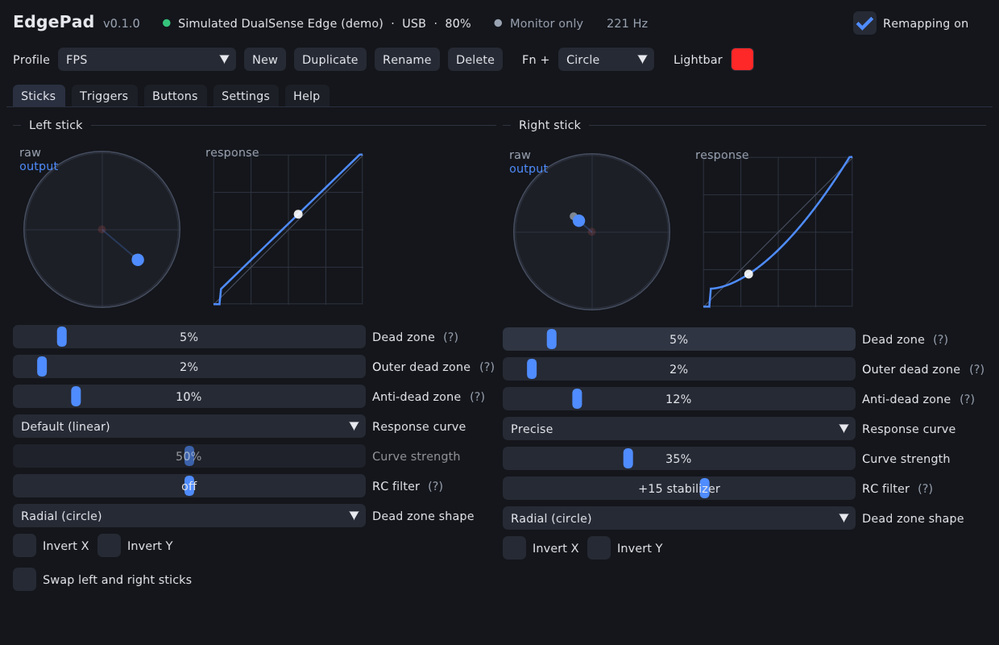

# EdgePad

DualSense and DualSense Edge remapper for PC: Edge-style profiles, back buttons, stick curves and
trigger stops, plus **anti-dead zone** and **GameSir-style RC filters**. It's written in C++, ships
as a single portable executable, and updates itself from this repository's releases.



## Features

| Area | What you get |
| --- | --- |
| **Sticks** | Inner / outer dead zone, **anti-dead zone**, radial or axial dead zone, invert X/Y, swap sticks, one-click **drift calibration** |
| **Response curves** | DualSense Edge presets (Default, Quick, Precise, Steady, Digital, Dynamic) with adjustable strength, plus a **Custom** curve you drag with the mouse |
| **RC filter** | GameSir style, active only while you move the stick. Positive = *stabilizer* (RC low-pass that removes micro-jitter). Negative = *jitter* mode |
| **Triggers** | Dead zone, **trigger stop** (short trigger range), anti-dead zone, **rapid hair trigger** (full press the moment you pull, releases as soon as you ease off, fires again without letting go), **turbo** (1–100 ms between presses), adaptive-trigger **resistance wall** that makes the stop something you can feel |
| **Gyro aiming** | Turn or tilt the controller to fine-aim on top of the right stick. Always on, while a button is held (e.g. L2 for aim down sights) or toggled. Sensitivity, vertical speed, yaw or roll, dead zone, smoothing for slow movements only, anti-dead zone, drift calibration |
| **Buttons** | Map any button, including the Edge **back buttons**, to a controller button, full L2/R2 press, **keyboard key** or **mouse button**, or disable it. Per-button **toggle** and **turbo** with its own 1–100 ms interval |
| **Shift layer** | Hold a shift button (e.g. a back button) and every button switches to a second set of bindings |
| **Touchpad zones** | Split the touchpad into 2 or 4 extra buttons, fired on click or on touch, which is great on a regular DualSense |
| **Profiles** | Up to 16 profiles. **Fn + Cross/Circle/Square/Triangle** switches profile from the controller, like the Edge. Lightbar colour and player LEDs show the active profile |
| **Controller** | DualSense and DualSense Edge over USB or Bluetooth, battery level, game rumble forwarded back to the controller |
| **Output** | Virtual **Xbox 360** or **PlayStation (DualShock 4)** controller via ViGEmBus on Windows, with gyro, accelerometer and touchpad passed through in PlayStation mode. uinput on Linux |
| **Portable** | One exe. Settings live in `EdgePad-data/` next to it, so the folder can sit on a USB stick |
| **Auto update** | Checks GitHub Releases on start, verifies the SHA-256 checksum and swaps in the new exe |

A regular DualSense works too. It has no back buttons, so the **Mute** button acts as Fn.

### Performance

- Controller input runs on its own thread, driven by the controller's HID reports (no polling sleeps).
- A report is turned into virtual controller output in microseconds.
- The virtual controller is only updated when the output actually changes.
- The UI renders at full rate only while focused; in the background it drops to about 15 fps, and it stops rendering while minimized.

## Getting started (Windows)

1. Download `EdgePad-windows-x64.exe` from the [latest release](../../releases/latest) and put it in any folder.
2. Install the [ViGEmBus driver](https://github.com/nefarius/ViGEmBus/releases/latest) once. It lets EdgePad create the virtual controller that games see.
3. Recommended: install [HidHide](https://github.com/nefarius/HidHide/releases/latest), add `EdgePad-windows-x64.exe`
   to its allowed applications and hide the DualSense. Games then only see the remapped virtual controller, so you never get double input.
4. Start EdgePad and connect the controller over USB or Bluetooth. It is picked up automatically.

If Steam is running, disable Steam Input's PlayStation support for the virtual controller so you only have one remapping layer.

For PlayStation button prompts, set **Settings → Virtual controller → PlayStation (DualShock 4)**. ViGEmBus can't
emulate a PS5 controller, so games see a PS4 controller. EdgePad passes the DualSense's gyro, accelerometer and
touchpad through to it, so motion aiming works in games that support it. You can also let games set the
lightbar colour, like on a real PlayStation controller.

## Getting started (Linux)

```sh
chmod +x EdgePad-linux-x64
sudo cp packaging/linux/70-edgepad.rules /etc/udev/rules.d/
sudo udevadm control --reload && sudo udevadm trigger
./EdgePad-linux-x64            # or --headless to run without a window
```

On Linux the virtual controller is an Xbox 360-style uinput device. Rumble forwarding is Windows only for now.

## Controller shortcuts

| Shortcut | Action |
| --- | --- |
| Fn + Cross / Circle / Square / Triangle | Switch to the profile with that hotkey |
| Fn + Options | Toggle remapping on/off (raw passthrough) |

Fn is either Edge Fn button, or Mute on a regular DualSense. You can change this under **Settings → Fn button**.
To use an Edge Fn button as a normal button (for example bound to a keyboard key), set the Fn button to
the other Fn button or to Mute. It then appears as bindable in the Buttons tab.
Buttons pressed as part of an Fn combo are never sent to the game.

## RC filter

Modelled on the RC filter in GameSir's controller software. Both modes only work **while you move
the stick**, meaning while it's pushed past its dead zone (at least 3%). With your thumb off the stick
nothing is added, even with a 0% dead zone or an anti-dead zone, and letting go stops instantly with no
smoothing tail.

- **Positive values (stabilizer):** a first-order RC low-pass on the raw stick signal. It smooths out micro-stutter so aim feels heavier and more consistent. The filter is time-based, so it feels the same at 250 Hz or 1000 Hz. At +100 the time constant is 40 ms.
- **Negative values (jitter):** while you move the stick, your aim wobbles a tiny amount side to side across the direction you push. The wobble is up to 6% of stick travel, changes side every 5 ms whatever the polling rate, and averages out to zero. Your aim speed stays the same and the stick never drops back into the game's dead zone. Some games keep aim assist engaged with this. **Some online games treat it as aim-assist abuse, so check the rules of the game you play.**

## Gyro aiming

1. Put the controller on a flat surface and click **Gyro → Calibrate gyro**. This removes sensor drift.
2. Set **Gyro** to *While a button is held* with **L2**, so the gyro only aims while you aim down sights.
   You can also leave it *Always on*, or use *Toggle*.
3. Adjust **Sensitivity** until small wrist movements move the crosshair the right amount. If the direction
   is reversed for you, flip **Invert X** or **Invert Y**.
4. Set **Anti-dead zone** to about the game's own stick dead zone so tiny movements register.

The gyro adds to the right stick, so the stick still handles big turns.

## Keyboard / mouse binds, toggle and turbo

Every button in the **Buttons** tab can send a controller button, a keyboard key or a mouse button:
- **Toggle:** tap once to hold the bind, tap again to release it.
- **Turbo:** repeats the press, with a *ms between presses* slider from 1 to 100 ms. The triggers have their own turbo in the Triggers tab.

Keyboard and mouse binds use Windows `SendInput` with hardware scan codes, which games read. Some
anti-cheat systems ignore injected keyboard/mouse input, and turbo or rapid fire is banned in many
ranked modes.

## Automatic updates

Every push to the default branch runs [`release.yml`](.github/workflows/release.yml). It builds and
tests Windows and Linux binaries, then publishes a GitHub release `v<VERSION>.<run number>` with
a `SHA256SUMS.txt`.

On start, EdgePad asks the GitHub API for the latest release. If it's newer, EdgePad downloads the
build for your platform, checks it against the published SHA-256, and swaps it in place of the
running exe. The new version runs after a restart (the app offers a *Restart now* button).

- Turn it off with **Settings → Install updates automatically**, or start with `--no-update`.
- Bump the `VERSION` file (e.g. `0.2`) for a new minor or major version. The patch number comes from CI.
- Local development builds never replace themselves.
- Dependabot keeps the GitHub Actions up to date. Each merge ships a new release, which reaches every user through the updater.

## Building from source

Requirements: CMake 3.21+, a C++20 compiler (Visual Studio 2022, GCC 11+ or Clang 14+) and git.
All libraries are fetched and linked statically by CMake.

```sh
cmake -S . -B build -DCMAKE_BUILD_TYPE=Release
cmake --build build --config Release --parallel
ctest --test-dir build -C Release --output-on-failure
```

On Linux, first install the build dependencies:
`sudo apt install libudev-dev libx11-dev libxrandr-dev libxinerama-dev libxcursor-dev libxi-dev libgl1-mesa-dev`.

Try the UI without a controller with `EdgePad --demo`, which simulates one.

### Command line

```
--headless          run without a window (Ctrl+C to quit)
--no-update         skip the automatic update check
--data-dir <path>   store settings somewhere else
--demo              simulate a controller (try settings without one)
--list              list connected controllers and exit
--version           print the version and exit
```

### Project layout

```
src/core/       platform independent: stick/trigger processing, RC filter, remapping pipeline,
                DualSense HID protocol, config JSON, versions, SHA-256   (unit tested)
src/platform/   hidapi device, ViGEmBus / uinput virtual controller, WinHTTP / curl, portable paths, self-update
src/app/        engine thread, updater, config store, Dear ImGui interface, main
tests/          doctest unit tests
```

## Notes

EdgePad is not affiliated with Sony Interactive Entertainment or GameSir. DualSense and DualSense Edge
are trademarks of Sony Interactive Entertainment. Third-party licenses are listed in
[THIRD_PARTY_NOTICES.md](THIRD_PARTY_NOTICES.md).
